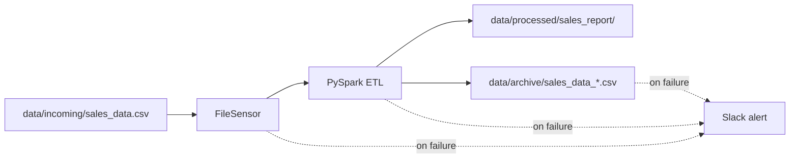

# Automated Sales Pipeline

An event-driven ETL pipeline that ingests sales CSV files, transforms them with PySpark, archives the raw input, and alerts on failure via Slack.

Built for local development with **Apache Airflow**, **PySpark**, and **Docker Compose**.

---

## What it does

1. **Wait** — Airflow `FileSensor` watches for `data/incoming/sales_data.csv`.
2. **Transform** — A PySpark job reads the CSV, adds a `total_amount` column (`quantity × price`), and writes output to `data/processed/sales_report/`.
3. **Archive** — The raw input file is moved to `data/archive/` with a timestamp suffix.
4. **Alert** — If any task fails, a Slack webhook notification is sent (when configured).



---

## Tech stack

| Component | Version / detail | Role |
| :--- | :--- | :--- |
| Orchestration | Apache Airflow 2.8.1 | DAG scheduling and task dependencies |
| Compute | PySpark (local mode) | CSV transformation |
| Database | PostgreSQL (Bitnami) | Airflow metadata store |
| Runtime | Docker Compose | Local multi-container setup |
| Alerting | Slack incoming webhook | Failure notifications |

---

## Project structure

```
Automated-Sales-Pipelines/
├── dags/
│   ├── send_slack_alert.py   # Airflow DAG (automated_sales_pipeline)
│   └── process_sales.py      # PySpark transformation script
├── data/
│   ├── incoming/             # Drop input CSV here
│   ├── processed/            # Spark output (CSV parts)
│   └── archive/              # Timestamped raw files
├── docker-compose.yml
├── Dockerfile
├── .env.example
└── README.md
```

---

## Prerequisites

- [Docker Desktop](https://www.docker.com/products/docker-desktop/) installed and running
- Git

---

## Setup

### 1. Clone the repository

```bash
git clone https://github.com/himanshu-data-nerd/Automated-Sales-Pipelines.git
cd Automated-Sales-Pipelines
```

### 2. Configure credentials

Copy the environment template and edit the values:

**Linux / macOS**

```bash
cp .env.example .env
```

**Windows (PowerShell)**

```powershell
Copy-Item .env.example .env
```

Open `.env` and set the variables described in `.env.example`:

| Variable | Required | Used by | Purpose |
| :--- | :--- | :--- | :--- |
| `SLACK_WEBHOOK_URL` | Recommended | Airflow Variable (manual step) | Slack alerts when a DAG task fails |
| `SMTP_EMAIL` | Optional | `docker-compose.yml` | Airflow built-in email (not used for DAG failure alerts) |
| `SMTP_PASSWORD` | Optional | `docker-compose.yml` | SMTP password or app password for the email above |

Example `.env` (matches `.env.example`):

```env
SLACK_WEBHOOK_URL=https://hooks.slack.com/services/YOUR/WEBHOOK/URL
SMTP_EMAIL=user@example.com
SMTP_PASSWORD=your_app_password_here
```

**Slack setup**

1. Create a [Slack incoming webhook](https://api.slack.com/messaging/webhooks).
2. Paste the URL into `SLACK_WEBHOOK_URL` in your `.env` file.
3. After the stack is running (step 3 below), register it with Airflow:

```bash
docker compose exec airflow-webserver airflow variables set slack_webhook_url "https://hooks.slack.com/services/YOUR/WEBHOOK/URL"
```

Use the same URL you saved in `.env`. If `slack_webhook_url` is not set in Airflow, the pipeline still runs; the failure callback will error only when a task actually fails.

**SMTP setup**

Leave `SMTP_EMAIL` and `SMTP_PASSWORD` blank unless you want Airflow email features. They are not used for DAG failure alerts in this project.

### 3. Start the stack

```bash
docker compose up -d --build
```

Wait until PostgreSQL is healthy and the webserver is up (usually 1–2 minutes):

```bash
docker compose ps
```

Open the Airflow UI at [http://localhost:8080](http://localhost:8080).

| Field | Value |
| :--- | :--- |
| Username | `admin` |
| Password | `admin` |

These credentials are created automatically for local development only. Do not use them in production.

---

## Run the pipeline

### 1. Enable the DAG

In the Airflow UI, toggle **ON** the DAG named `automated_sales_pipeline`.

### 2. Prepare input data

The pipeline expects a file named **`sales_data.csv`** with this schema:

| Column | Type | Description |
| :--- | :--- | :--- |
| `product_id` | integer | Product identifier |
| `quantity` | integer | Units sold |
| `price` | number | Unit price |
| `category` | string | Product category |

Example:

```csv
product_id,quantity,price,category
101,5,1200,Electronics
102,2,500,Clothing
```

Create the incoming folder if it does not exist, then place the file:

**Linux / macOS**

```bash
mkdir -p data/incoming
cp your_sales_file.csv data/incoming/sales_data.csv
```

**Windows (PowerShell)**

```powershell
New-Item -ItemType Directory -Force -Path data\incoming
Copy-Item your_sales_file.csv data\incoming\sales_data.csv
```

### 3. Trigger or wait for a run

The DAG is scheduled to run **daily** (`@daily`). You can also trigger a manual run from the Airflow UI (**Trigger DAG**).

The `FileSensor` checks every 30 seconds for up to 1 hour per run. Once the file is found:

- PySpark writes transformed data to `data/processed/sales_report/`
- The input file is archived under `data/archive/`

### 4. Check output

Processed files appear as Spark CSV parts, for example:

```
data/processed/sales_report/part-00000-....csv
```

Each row includes the original columns plus `total_amount`.

---

## DAG tasks

| Task ID | Description |
| :--- | :--- |
| `wait_for_incoming_data` | Waits for `sales_data.csv` in `data/incoming/` |
| `trigger_spark_job` | Runs `dags/process_sales.py` |
| `archive_processed_file` | Moves the input file to `data/archive/` |

Task order: `wait_for_incoming_data` → `trigger_spark_job` → `archive_processed_file`

---

## Troubleshooting

| Issue | What to check |
| :--- | :--- |
| DAG not visible | Confirm `dags/send_slack_alert.py` is mounted and the scheduler container is running |
| Sensor times out | Ensure the file is named exactly `sales_data.csv` and placed in `data/incoming/` before the sensor timeout (1 hour) |
| Spark task fails | View logs for `trigger_spark_job` in the Airflow UI |
| No Slack message | Verify `slack_webhook_url` is set: `docker compose exec airflow-webserver airflow variables list` |
| Port 8080 in use | Change the host port in `docker-compose.yml` under `airflow-webserver` |

---

## Stop the stack

```bash
docker compose down
```

To remove the PostgreSQL volume as well:

```bash
docker compose down -v
```

---

## Author

**Himanshu** — Aspiring Data Platform Engineer
